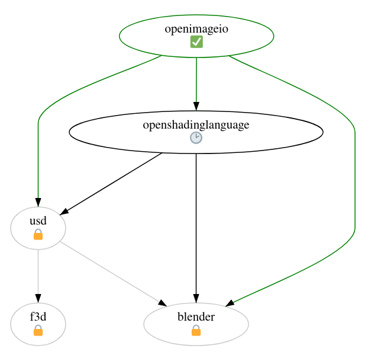

Agenda
---

- Introduction
- The past
- The present
- The future
- How it works
- The vision
- How we'll get there
- Stay up-to-date
- Conclusion


<!-- end_slide -->

Introduction
---

# buildbtw: automatic build service

<!-- pause -->
- Isolated staging repos
<!-- pause -->
- Enables multi-arch builds
<!-- pause -->
- GitLab-based collaboration
<!-- pause -->
- Easy mass rebuilds

<!-- end_slide -->

The past
---

# Packager interviews

<!-- pause -->
- We interviewed 12 packagers
- Thank you for partaking!

<!-- pause -->

## Wishlist

<!-- pause -->
- mainly CLI, complementary Web UI
<!-- pause -->
- async building, GitOps
<!-- pause -->
- automating rebuilds: hard but possible
<!-- pause -->
- isolated staging repos

<!-- end_slide -->

The past
---

# Prior art
<!-- pause -->
- Evaluated buildbot, koji, alpine CI, OBS 
<!-- pause -->
- Decided to build custom solution instead

<!-- end_slide -->

The present
---

# Building a proof-of-concept

- Local building
- Check reverse dependencies
- Rerun on changes
- GitLab runner integration
- Release queue

<!-- end_slide -->

The future
---

# The MVP for production

- RFC
- async build offloading
- local signing & releasing

## Iterating
- Deploy MVP ASAP
- Keep making improvements

<!-- end_slide -->

How it works
---

<!-- column_layout: [2, 3]-->
<!-- column: 0 -->
# Terminology
- Namespace
- Iteration
- BuildSet

<!-- column: 1 -->
# Release queue
- Ensure release order

<!-- end_slide -->

Simple usage example
---

- soname bump
```sh
pkgctl build new-namespace --name openimageio-v2.5.17.0
pkgctl version upgrade
git commit -am "Bump to v2.5.17.0"
git push
```
<!-- end_slide -->

<!-- end_slide -->

Complex usage example
---

- Python interpreter bump
<!-- pause -->
```sh
cd python
pkgctl build new-namespace --name python-v3.13
vim PKGBUILD
git commit -am "Bump to v3.13"
git push
```
<!-- end_slide -->

Complex usage example
---

- python-absl broken
<!-- pause -->
```sh
cd python-absl
pkgctl repo switch python-v3.13
vim PKGBUILD
git commit -am "Fix breakage with Python v3.13"
git push
```
<!-- end_slide -->

Stay up-to-date
---
- [buildbtw repo & issues](https://gitlab.archlinux.org/archlinux/buildbtw)
- [Matrix](https://matrix.to/#/#buildbtw:archlinux.org)

<!-- end_slide -->

Conclusion
---

<!-- pause -->
- Free up packagers' time
<!-- pause -->
- More architectures
<!-- pause -->
- Better workflows
<!-- pause -->
- More confidence

<!-- end_slide -->

Thank you
---

- Let's make Arch automagic together!
